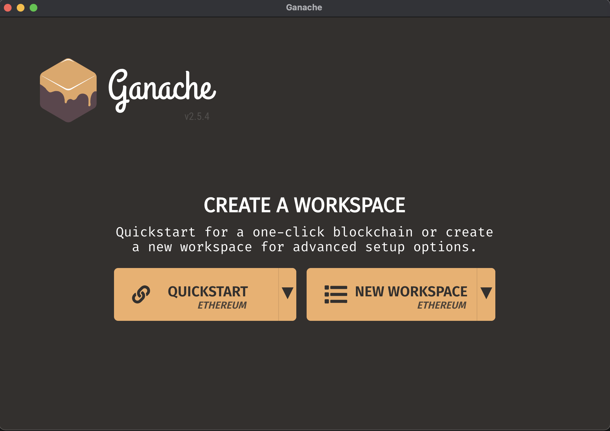
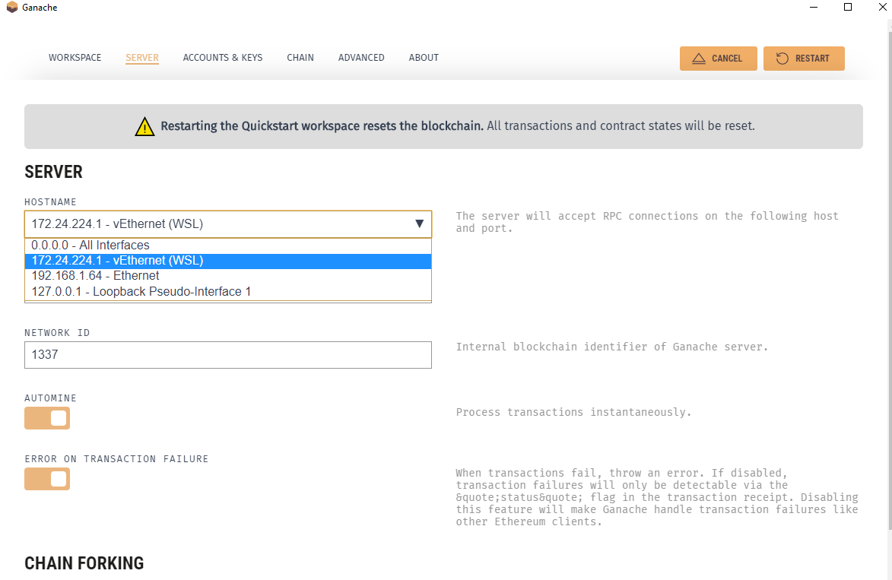
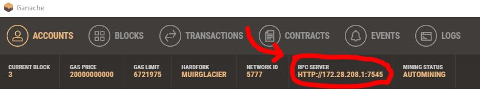
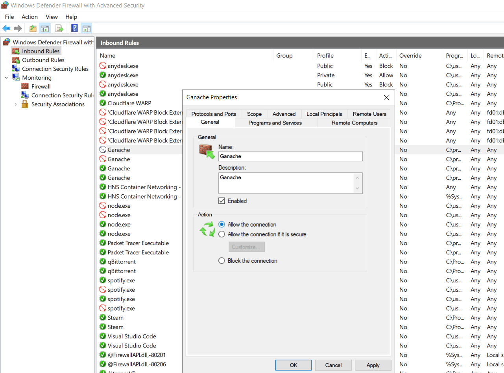

# Ethers.js Simple Storage

# Overview

## Objectives:

-   Introduction to the [ethers.js](https://docs.ethers.io/v5/) library.
-   Introduction to deploying a contract to a local blockchain (Ganaches UI) or to a testnet.
-   This contract allows an user to store a number.

# Quickstart

## Requirements

-   [Git](https://git-scm.com/book/en/v2/Getting-Started-Installing-Git)
    -   Verify git was installed by running `git --version`, if the response looks like `git version x.x.x` it means the installation was correct.
-   [Node.js](https://nodejs.org/en/)
    -   Verify it was installed by running `node --version`, if the response looks like `vx.x.x` it means the installation was correct.
-   [Yarn](https://classic.yarnpkg.com/lang/en/docs/install/#windows-stable)
    -   The installation was a success if you can run:
        -   `yarn version` and the response looks like ``x.x.x`
        -   Note: you might need to install `yarn` using `npm`
-   [Ganache](https://trufflesuite.com/ganache/)

    -   Install the app, launch it and if the window looks like the below image the installation was correct.
    -   You can also use [ganache-cli](https://www.npmjs.com/package/ganache-cli) and [hardhat](https://hardhat.org/) as development chains.

    <div align="center">
      
    </div>

# Setup

Clone this repo, cd into the folder and run the following commands:

```
git clone https://github.com/PacelliV/ethers-simple-storage
cd ethers-simple-storage
```

To install all dependencies run:

```
yarn
```

# Usage

## Using Ganache UI

1. Launch ganache and click on `quickstart` to run the local blockchain.
2. Go to settings and select a WSL hostname, save and restart the application.

<div align="center">
      
</div>

3. Save the workspace.
4. Copy the `RPC SERVER`.

<div>
      
</div>

5. Save it as an `environment variable` in your `.env` file, example:

```
RPC_URL=http://172.28.208.1:7545
```

6. Select an account, copy the `private key` and save it as an `environment variable` in your `.env` file, example:

```
PRIVATE_KEY=11ee3108a03081fe260ecdc106554d09d9d1209bcafd46942b10e02943effc4a
```

7. Compile your code by running:

```
yarn compile
```

8. Two files will be created:

    - `SimpleStorage_sol_SimpleStorage.abi`
    - `SimpleStorage_sol_SimpleStorage.bin`

9. Run your application

```
node deploy.js
```

<b>NOTE:</b> In case Windows Defender block the conection with Ganache, you'll need to go to `Windows Defender Firewall with Advanced Security`, look for Ganache and override the security. All icons associated with Ganache should have a checkmark.

<div>
      
</div>

## Deploying to a testnet

Install [Metamask](https://metamask.io/) or any other wallet to import the `private key`.

<b>IMPORTANT: for testing purposes it's recommended to create a new wallet, never use a wallet associated with real funds.</b>

1. [Export your private key](https://metamask.zendesk.com/hc/en-us/articles/360015289632-How-to-Export-an-Account-Private-Key) into your `.env` file.
2. Got to [Alchemy](https://www.alchemy.com/), register and create a new project in a tesnet, i.e. Goerli.
3. Export the associated URL with your project and store it in your `.env` file.
4. Get some test ETH, you can get some [here](https://faucets.chain.link/).
5. Run your application:

```
node deploy.js
```

## Thanks you 🎉 🎉

I hope you like this project and I encourage you to make your own modifications.
